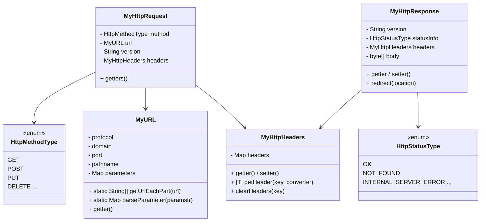
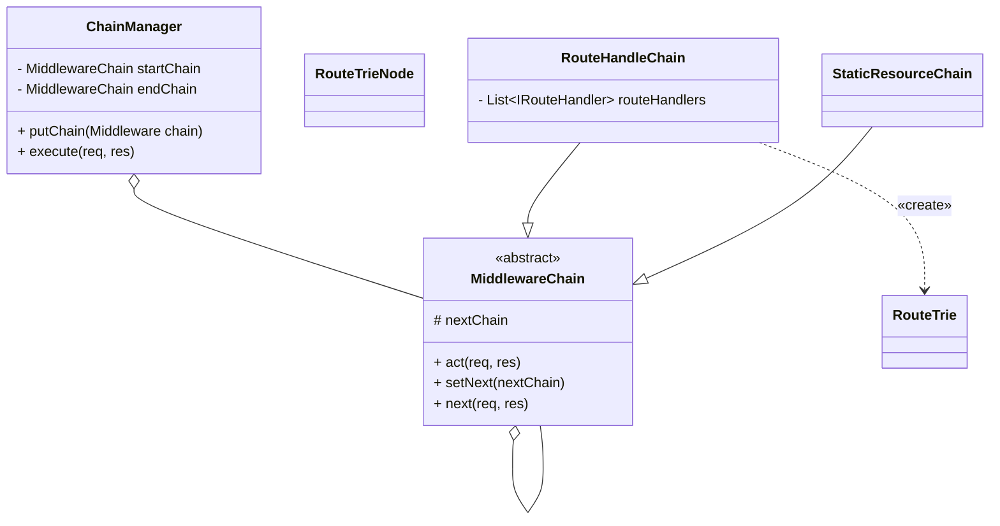
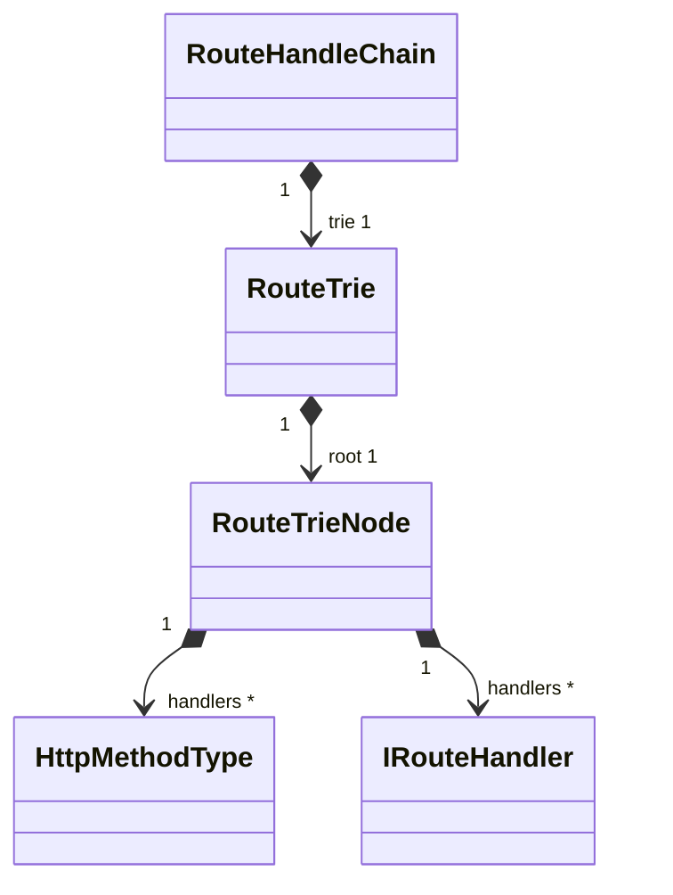
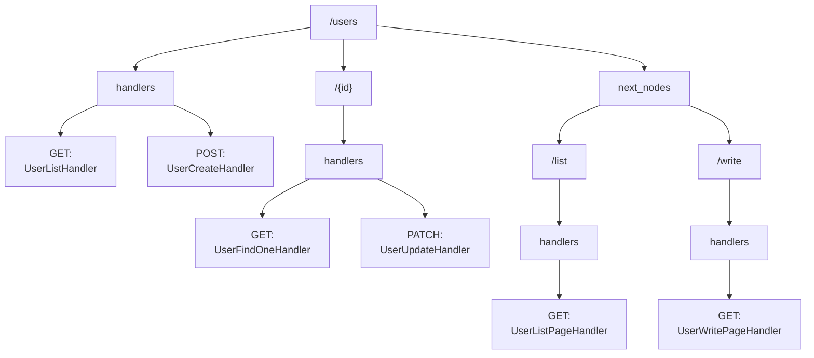

# be-was-2024
코드스쿼드 백엔드 교육용 WAS 2024 개정판

## 전반적인 흐름
1. 사용자가 요청을 보낸다. 요청은 RequestHandler로 표현되며, 별도의 스레드로 실행된다.
2. RequestHandler은 요청을 파싱하여 만들고, 비어 있는 응답을 생성한다.
3. 생성된 요청 및 응답은 ChainManager에 전달된다.
4. ChainManager은 내부에 등록된 MiddlewareChain들에게 요청 및 응답을 넘긴다
5. 각 MiddlewareChain은 각자의 로직에 따라 요청 및 응답을 처리하고, 다음 체인에게 넘기거나 넘기지 않는다.
   - StaticResourceChain: 대응되는 정적 리소스를 반환한다.
   - RouteHandleChain: 요청된 경로를 처리한다.
      - IRouteHandler: 각 경로를 의미하는 객체. canMatch로 검사하고 handle로 작업한다.
6. 모든 MiddlewareChain을 거친 응답은 HttpResponseMessageBuildUtil에 의해 Http 메시지로 가공된다
7. 가공된 응답 메시지는 RequestHandler가 가진 sendResponse 메서드를 통해 사용자에게 응답된다.

## 요청 / 응답의 클래스 관계

요청 / 응답을 별도의 클래스로 분리했다. HTTP Method, URL 등 요소를 별도의 객체로 분리하여 관리하는 것 보다는 HTTP Request / Response라는  통합된 단위로 관리하는 것이 장기적으로 관리하고 이해하기 쉬울 것이라고 판단했다. 두 객체는 순수한 HTTP 요청 / 응답을 표현하는 동시에, 일부 웹 개발을 위한 유틸 기능을 가지게 확장할 예정이다. 예를 들어, 현재 MyHttpResponse는 redirect 관련 유틸 메서드를 가지고 있다.

Http 메시지 처리 과정에서 사용되는 일종의 상수들이 있다.
- HTTP Method: GET, POST ...
- HTTP Status: 200 OK, 404 NOT FOUND ...
- MIME Type: text/html, application/json ... 

이러한 의미를 가진 상수들은 프로젝트에서 문자열 또는 숫자 그 자체로 사용되면 실수가 발생할 여지가 크다. 따라서 이들을 별도의 클래스(enum)로 분리하여 관리하기 쉽게 만들었다. 장기적으로 해당 enum에서 지원하는 타입 또는 관련 메서드가 추가되더라도 단순 문자열 처리 방식에 비해 변경이 적어질 것으로 예상된다.

## 미들웨어

미들웨어는 요청 & 응답을 이용하여 작업을 수행하는 단위로, 자신의 작업을 마친 후 next 메서드를 호출하여 다른 미들웨어에게 작업을 넘길 수 있다. 요청 - 응답 프로세스 중 새로운 작업이 필요한 경우, 새로운 미들웨어로 구현하여 등록한다.

- 유저 세션 관리
- static 파일 제공
- upload 파일 제공
- 권한 확인 및 거부
- 라우팅

## 라우팅 구조

현재 프로젝트에서 라우팅은 Trie 자료구조 기반으로 동작한다. 각 노드는 pathname을 '/' 단위로 자른 path segment에 대응되며, 다음 path segment에 대한 라우팅 책임을 가진다.
- RouteTrie: 라우팅을 위한 Trie 자료구조
- RouteTrieNode: 하나의 path segment를 담당하는 노드
- IRouteHandler: HTTP Method 및 경로에 매칭되는 핸들러

### 동작 방식

1. RouteTrie에 pathname이 도착한다.
2. pathname을 / 단위로 쪼갠다. /hello/world라면, hello와 world가 path segment가 된다.
3. RouteTrie의 root 노드부터 시작해 path segment를 노드에 매칭한다.
4. 경로가 매칭되지 않는다면, path variable이 있는지 검사한다. 있다면 현재 path segment를 path variable로 간주하고 경로를 계속 탐색한다.
5. 최종 매칭된 노드에 요청된 http method에 대한 핸들러가 있다면 반환한다.