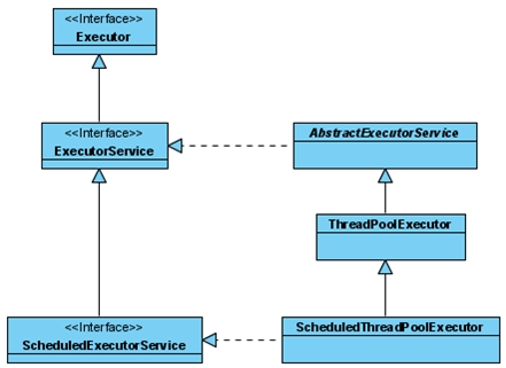

# be-was-2024
# URL Parsing하기

Socket은 사용자의 연결을 위한 클래스.

ServerSocket은 서버의 연결을 위한 클래스.

```java
Socket connection;
connection.getInputStream();
```

을 이용해 사용자의 요청을 모두 읽어들일 수 있다.

```java
BufferedReader br = new BufferedReader(new InputStreamReader(in));

String line;
while(!(line = br.readLine().isEmpty()) {
	log.debug(line);
}
```

을 이용해 요청을 모두 읽은 후 출력할 수 있다.

# 파일 Byte Array로 읽어오기

## 1. Files.readAllBytes

java의 nio패키지를 이용하여 다음과 같이 파일을 읽어올 수 있다.

```java
byte[] body = Files.readAllBytes(new File("파일 경로").toPath()); 
```

## 2. FileInputStream.read(byte[] b);

java io의 FileInputStream을 이용하여 byte array로 읽는게 가능하다.

```java
File html = new File("src/main/resources/static" + url);
byte[] body = new byte[(int) html.length()];

// 버퍼를 사용하면 빠르게 가져올 수 있음
try (FileInputStream fileInputStream = new FileInputStream(html);
BufferedInputStream bufferedInputStream = new BufferedInputStream(fileInputStream);) {
        bufferedInputStream.read(body);
}
```

# Concurrent 패키지

작업을 스레드에 할당시켜 실행하면 큰 작업을 나누어 실행시켜 빠르게 작업을 완료할 수 있다는 장점이 있다. 하지만 작업을 수행할 때마다 스레드를 생성하고, 스레드를 종료한다면 그에 따른 오버헤드가 커져 오히려 실행 시간이 더 오래 걸릴 수 있다.

Thread.start()가 아닌 Executor와 ExecutorService를 이용하여 더 효율적으로 스레드를 관리할 수 있다.

Executor와 ExecutorService는 스레드 풀의 구현을 위한 인터페이스이다. 등록된 작업(Runnable)을 실행하는 기능을 가지고 있다.

ExecutorService를 이용하면 스레드 풀(Thread Pool)을 관리할 수 있다.

### Executor의 구조


ExecutorService 내부에는 블로킹 큐와 스레드 풀을 가지고 있다. 스레드 풀 개수만큼 작업을 할당한 후 추가로 작업이 들어오면 블로킹 큐에 작업을 넣어 기다리게 한다.

예를 들어 스레드 풀의 크기가 3인 상태에서 T1, T2, T3, T4 4개의 작업이 들어오면 들어온 순서대로 3개의 작업을 스레드 풀에 할당한 후, 나머지 하나의 작업은 블로킹 큐에서 기다리게 된다. 앞의 작업이 완료되어 빈 스레드가 생기면 기다리던 작업을 할당받아 작업을 수행한다.

ExecutorService는 Executor의 상태를 관리하기 위한 메소드들도 가지고 있다.

- shutdown
    - 새로운 작업을 받아들이지 않음
    - 제출된(현재 실행중인) 작업들은 그대로 종료
- shutdownNow
    - shutdown에 추가해서 현재 실행중인 작업들에 인터럽트를 걸어줌
    - 대기중인 작업 목록 반환
- isShutdown
    - Executor의 셧다운 여부 반환
- isTerninated
    - shutdown실행 후 모든 작업의 실행이 종료되었는지 여부 반환
- awaitTermination
    - shutdown실행 후 지정한 시간동안 작업이 종료될 때까지 기다림
    - 지정한 시간 내에 작업이 모두 종료되었는지 여부 반환

작업이 완료되었다면 shutdown을 반드시 호출하여 종료시켜주자. 그렇지 않으면 계속 작업을 기다리게 됨.

Executor, ExecutorService, ScheduledExecutorService는 스레드 풀 관리를 위한 인터페이스이다. 하지만 이를 직접 관리하는 것을 어렵다. 관리의 편의를 위해 Executors라는 팩토리 클래스가 존재한다. 스레드 풀을 손쉽게 생성해준다.

- newFixedThreadPool
    - 고정된 크기의 스레드 풀 생성
    - ExecutorService를 구현한 ThreadPoolExecutor 객체가 생성됨
- newCachedThreadPool
    - 알아서 필요한 만큼의 스레드 풀 생성
    - 이미 생성된 스레드 재활용 가능
- newScheduledThreadPool
    - 일정 시간 뒤 혹은 주기적으로 실행되어야 하는 스레드 풀을 생성
    - ScheduledExecutorService를 구현한 ScheduledThreadPoolExecutor 객체가 생성됨
- newSingleThreadExecutor, newSingleScheduledExecutor
    - 크기가 1인 스레드 풀 생성

코드로는 다음과 같이 작성한다

```java
ExecutorService executorService = Executors.newCachedThreadPool();
executorService.execute(new RequestHandler(connection));
// RequestHandler는 Runnable 인터페이스를 구현한 클래스
// run() 메소드를 가지고 있음
```

인터럽트에 대한 예외를 처리하기 위해 다음과 같이 작성한다

```java
public void run() {
	try {
		while (!Thread.currentThread.isInterrupted()) {
			// 작업
		}
	} catch (InterruptedException e) {
		logger.error(e.getMessage());
	}
}
```